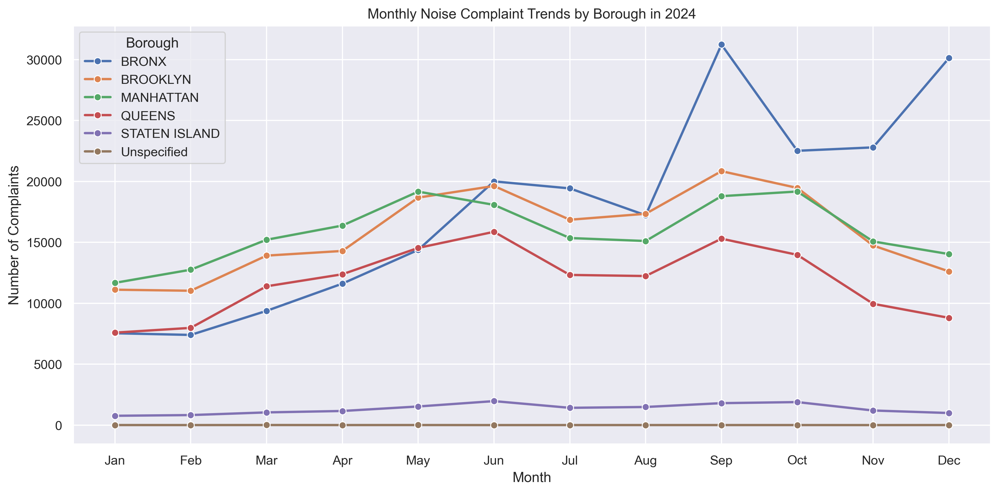
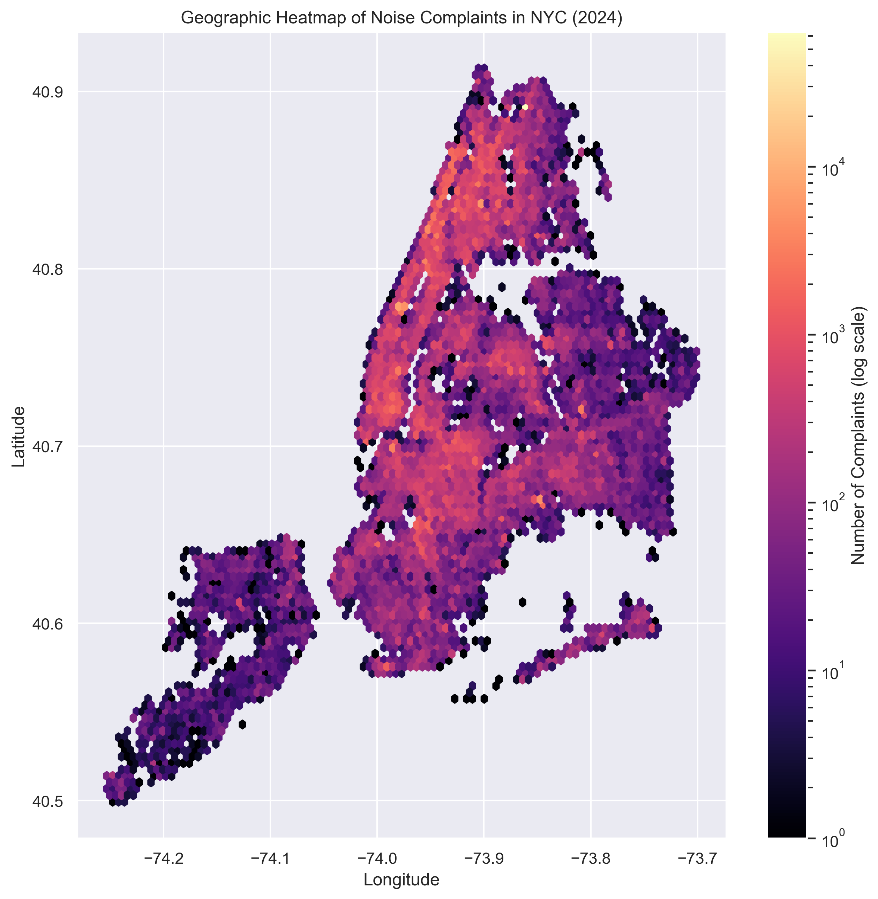

# NYC Noise Complaint Analysis

This project analyzes NYC 311 noise complaint data to uncover spatial and temporal patterns and forecast future complaint volumes. By understanding when and where noise complaints are most likely to occur, city agencies can better allocate enforcement resources and address recurring problem areas. The goal is to help answer questions like:
- When do most noise complaints occur?
- Which boroughs report the most noise?
- Are there seasonal or time-based trends?
- Can we forecast complaint volume over time? By season? By location?

## Tools Used
- Python (pandas, numpy, matplotlib, seaborn, scikit-learn) for data cleaning, exploration, and forecasting
- SQL for querying, aggregating, and joining datasets
- Jupyter Notebooks for exploratory analysis and model development

## Dataset
NYC 311 Service Requests filtered to noise complaints (sample dataset: 311_noise_complaints_2024.csv). Includes date/time, complaint type, borough, and geolocation information.

## Repository Structure
```
nyc-noise/
├── data_raw/                         # Raw data (unmodified source files)
│   └── 311_noise_complaints_2024.csv
├── data_processed/                   # Cleaned/aggregated data ready for analysis
├── notebooks/                        # Jupyter notebooks for EDA, forecasting, mapping
│   └── nyc_311_noise_analysis.ipynb
├── src/                              # Python scripts for cleaning, feature engineering
├── assets/                           # Images/plots for README and reports
├── dashboards/                       # Tableau/Power BI dashboards
├── reports/                          # Project reports or summaries
├── sql/
│   └── init_table.sql                # Drops/creates table + loads CSV
├── scripts/
│   └── setup_db.py                   # Creates database + runs init_table.sql
│
├── environment.yml                   # Conda environment (alternative to requirements.txt)
├── LICENSE                           # Open-source license
└── README.md                         # Project overview and instructions
```

## Status (updated September 1, 2025)
Adding an ETL pipeline using SQL

## Next Steps
- Build baseline time series forecast models (seasonal naive, SARIMA)
- Evaluate model accuracy and identify high-risk time windows
- Create a Tableau dashboard for interactive exploration

## Getting Started
This project uses PostgreSQL for data storage and Conda for environment management.  
Follow the steps below to set up the environment, load the data, and generate the cleaned datasets.

### Prerequisites
- PostgreSQL installed and accessible via `psql`
- Conda (or Mamba) installed
- A PostgreSQL user with permission to create databases and tables

### 1. Set up the environment
From the repo root (`nyc-noise/`), create and activate the environment:

```bash
conda env create -f environment.yml
conda activate nycnoise
```

### 2. Load data into PostgreSQL
Run the setup script to create the database, build tables, and load data:

```bash
python scripts/setup_db.py
```

This will:
1. Create a database called `nyc_noise` if it does not already exist.  
2. Run `sql/init_table.sql` to create two tables:  
   - `noise_complaints_2024` (raw, full schema)  
   - `noise_complaints_clean` (slimmed, analysis-ready schema)  
3. Export the cleaned SQL dataset to `data_processed/noise_complaints_clean_sql.csv`.  

### 3. Generate Python-cleaned dataset (optional)
You can also use the Jupyter notebook to produce a parallel cleaned dataset:

```bash
jupyter notebook notebooks/nyc_311_noise_analysis.ipynb
```

The notebook will:  
- Clean and transform the raw dataset with pandas.  
- Save an additional file to `data_processed/noise_complaints_clean_py.csv`.  
- Export key visualizations into `assets/` for use in the README or reports.  

### 4. Verify the outputs
Check the processed files in your repo:

```bash
head data_processed/noise_complaints_clean_sql.csv
head data_processed/noise_complaints_clean_py.csv
```

You can connect Tableau, Python, or other tools directly to these CSVs.  

### Notes
- By default the script uses your system username as the Postgres user.  
- To override, set the environment variable `PGUSER` before running the script:

```bash
PGUSER=your_pg_username python scripts/setup_db.py
```

## Outputs & Visualizations

### Monthly Noise Complaint Trends (2024)


### Geographic Heatmap of Noise Complaints

